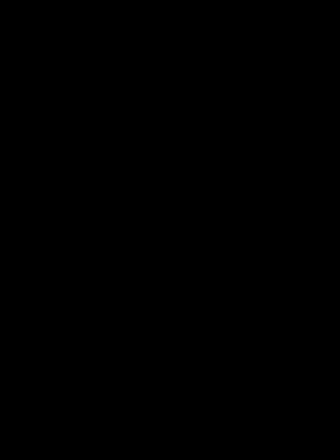

"# Lorentz-Attractor" 

This is a simple implementation of the Lorenz Attractor in Python. The Lorenz Attractor is a system of three non-linear ordinary differential equations first studied by Edward Lorenz. It is notable for having chaotic solutions for certain parameter values and initial conditions. The attractor is named after Edward Lorenz, who was inspired by the shape of the butterfly wings when he first saw the attractor in 1963. The attractor is also known as the Lorenz system or Lorenz chaos.

Differential Equations

The Lorenz system is defined by the following equations:

\begin{align} \frac{dx}{dt} & = \sigma(y-x) \\ \frac{dy}{dt} & = \rho x - y - xz \\ \frac{dz}{dt} & = -\beta z + xy \end{align}

where

* x, y, z are the coordinates of a point in 3-dimensional space
* t is time
* \sigma, \rho, \beta are parameters, typically set to \sigma = 10, \rho = 28, \beta = \frac{8}{3}

